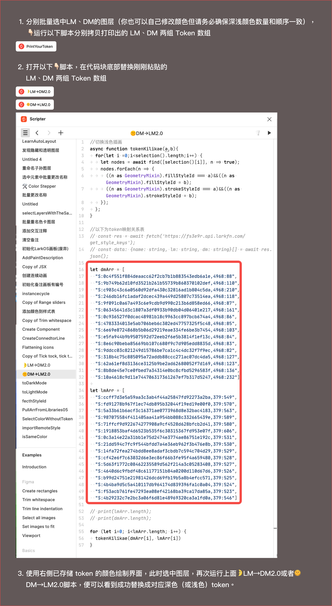

# dark-mode-switcher
一个运行在FigmaScripter的脚本片段，利用它可以快速切换界面的深浅模式

01. 下载导入 TokenScriptConfig.fig 文件到Figma；

02. 按照截图顺序运行脚本 -> 创建或修改你的申请模式颜色token -> 分别打印LM、DM两组图层的token  ->  拷贝token数组  ->  替换到  🌛LM→DM2.0或者🌞DM→LM2.0脚本底部，保存后就得到你自定义的脚本代码，使用它运行可以切换保存两组数组内的任意颜色。

